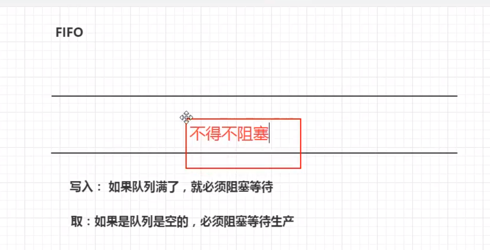

## 前言

并发编程的本质：充分利用cpu资源。


> 线程的几个状态

```java
public enum State {
    /**
     * Thread state for a thread which has not yet started.
     */
    // 新生
    NEW,

    /**
     * Thread state for a runnable thread.  A thread in the runnable
     * state is executing in the Java virtual machine but it may
     * be waiting for other resources from the operating system
     * such as processor.
     */
    // 运行
    RUNNABLE,

    /**
     * Thread state for a thread blocked waiting for a monitor lock.
     * A thread in the blocked state is waiting for a monitor lock
     * to enter a synchronized block/method or
     * reenter a synchronized block/method after calling
     * {@link Object#wait() Object.wait}.
     */
    // 阻塞
    BLOCKED,

    /**
     * Thread state for a waiting thread.
     * A thread is in the waiting state due to calling one of the
     * following methods:
     * <ul>
     *   <li>{@link Object#wait() Object.wait} with no timeout</li>
     *   <li>{@link #join() Thread.join} with no timeout</li>
     *   <li>{@link LockSupport#park() LockSupport.park}</li>
     * </ul>
     *
     * <p>A thread in the waiting state is waiting for another thread to
     * perform a particular action.
     *
     * For example, a thread that has called <tt>Object.wait()</tt>
     * on an object is waiting for another thread to call
     * <tt>Object.notify()</tt> or <tt>Object.notifyAll()</tt> on
     * that object. A thread that has called <tt>Thread.join()</tt>
     * is waiting for a specified thread to terminate.
     */
    // 等待，死死的等
    WAITING,

    /**
     * Thread state for a waiting thread with a specified waiting time.
     * A thread is in the timed waiting state due to calling one of
     * the following methods with a specified positive waiting time:
     * <ul>
     *   <li>{@link #sleep Thread.sleep}</li>
     *   <li>{@link Object#wait(long) Object.wait} with timeout</li>
     *   <li>{@link #join(long) Thread.join} with timeout</li>
     *   <li>{@link LockSupport#parkNanos LockSupport.parkNanos}</li>
     *   <li>{@link LockSupport#parkUntil LockSupport.parkUntil}</li>
     * </ul>
     */
    // 超时等待
    TIMED_WAITING,

    /**
     * Thread state for a terminated thread.
     * The thread has completed execution.
     */
    // 终止 
    TERMINATED;
}
```

> wait sleep的区别

1. 来自不同的类

   wait=》object

   sleep=》Thread

   企业当中，休眠用sleep吗？不用，用TimeUnit类

2. 关于锁的释放

   wait会释放锁（等待）

   sleep抱着锁睡觉（睡觉）

3. 使用范围不同

   sleep可以在任何地方睡

   wait必须在同步代码块


### Lock锁（重点）

> 传统的synchronized

```java
package com.lihe.demo01;

// 基本的卖票例子
/**
 * 真正的多线程开发，公司中的开发,降低耦合性
 * 线程就是一个单独的资源类，没有任何附属的操作
 * 1.属性
 * 2.方法
 */
public class SaleTicketDemo01 {

    public static void main(String[] args) {
        // 并发，多个线程操作同一个资源类,把资源类丢入线程
        Ticket ticket = new Ticket();

        // lambda ()->{}
        new Thread(()->{
            for (int i = 0; i < 60; i++) {
                ticket.sale();
            }

        },"A").start();
        new Thread(()->{
            for (int i = 0; i < 60; i++) {
                ticket.sale();
            }
        },"B").start();
        new Thread(()->{
            for (int i = 0; i < 60; i++) {
                ticket.sale();
            }
        },"C").start();
    }


}
// 资源类 OOP
class Ticket{
//     * 1.属性 2.方法，不能实现额外的接口
    private int number = 50;
    // 买票的方式
    // synchronized本质就是排队
    public synchronized void sale(){
        if (number > 0){
            System.out.println(Thread.currentThread().getName() + "迈出了第" + number-- + "张票，剩余" + number);
        }
    }
}
```


> Lock


可重入锁（常用）


公平锁：十分公平，可以先来后到

非公平锁：十分不公平，可以插队（默认）

```java
package com.lihe.demo02;

// 基本的卖票例子

import java.util.concurrent.locks.Lock;
import java.util.concurrent.locks.ReentrantLock;

/**
 * 真正的多线程开发，公司中的开发,降低耦合性
 * 线程就是一个单独的资源类，没有任何附属的操作
 * 1.属性
 * 2.方法
 */
public class SaleTicketDemo01 {

    public static void main(String[] args) {
        // 并发，多个线程操作同一个资源类,把资源类丢入线程
        Ticket ticket = new Ticket();

        // lambda ()->{}
        new Thread(()->{
            for (int i = 0; i < 60; i++) {
                ticket.sale();
            }

        },"A").start();
        
        new Thread(()->{
            for (int i = 0; i < 60; i++) {
                ticket.sale();
            }
        },"B").start();
        
        new Thread(()->{
            for (int i = 0; i < 60; i++) {
                ticket.sale();
            }
        },"C").start();
    }


}

// Lock 三部曲

/**
 * 1. new lock;
 * 2. lock.lock();
 * 3. finally{lock.unlock();}
 */
class Ticket{
//     * 1.属性 2.方法，不饿能实现额外的接口
    private int number = 50;

    Lock lock = new ReentrantLock();
    // 买票的方式
    // synchronized本质就是排队
    public void sale(){
        
        
        lock.lock();
        try {
            if (number > 0){

                System.out.println(Thread.currentThread().getName() + "迈出了第" + number-- + "张票，剩余" + number);
            }
        }catch (Exception e){
            e.printStackTrace();
        }finally {
            lock.unlock();
        }
        
    }
}
```


> synchronized 和 lock的区别

1. synchronized是内置关键字，lock是一个类（接口）
2. synchronized无法判断获取锁的状态，lock可以判断是否获取了锁
3. synchronized会自动释放锁，lock必须要手动释放锁，如果不释放锁，**死锁**
4. synchronized 线程1（获得锁，阻塞） 线程2（等待，傻傻的等），Lock锁不一定一直等下去 `lock.tryLock();`
5. synchronized 可重入锁，不可以中断的，非公平的；lock粒度更高，可重入，可以判断锁，非公平，公平；
6. synchronized适合锁少量的代码同步问题，lock适合锁大量的代码（为什么）。


> 锁是什么，如何判断锁的是谁？


### 生产者和消费者问题

synchronized  wait notify

**==面试：单例模式，八大排序，生产者消费者问题，死锁问题==**

今天学JUC版本的

> 大有门道


> synchronized版本生产者消费者

```java
package com.lihe.productorconsumer;

/**
 * 线程之间的通信问题：生产者和消费者问题！ 等待唤醒，通知唤醒
 * 线程交替执行 A B操作同一个变量 num=0
 * A num+1
 * B num-1
 */
public class Demo01 {
    public static void main(String[] args) {
        Data data = new Data();

        new Thread(()->{
            for (int i = 0; i < 10; i++) {
                try {
                    data.increment();
                } catch (InterruptedException e) {
                    e.printStackTrace();
                }
            }
        }, "A").start();

        new Thread(()->{
            for (int i = 0; i < 10; i++) {
                try {
                    data.decrement();
                } catch (InterruptedException e) {
                    e.printStackTrace();
                }
            }
        }, "B").start();
    }
}


// 等待（判断） 业务（干活） 通知
// 数字 资源类
class Data{
    private int number = 0;

    // +1
    public synchronized void increment() throws InterruptedException {
        if (number!= 0){
            // 等待
            this.wait();
        }

        number++;
        // 通知其他线程，我+1完毕了
        System.out.println(Thread.currentThread().getName() + "==>" + number);
        this.notifyAll();
    }
    // -1
    public synchronized void decrement() throws InterruptedException {
        if (number == 0){
            // 等待
            this.wait();
        }
        number--;
        // 通知其他消费者，-1完毕
        System.out.println(Thread.currentThread().getName() + "==>" + number);
        this.notifyAll();
    }
}
```

> 问题存在，A B两个线程，四个线程还安全吗？ --》虚假唤醒


原因的理解，为什么出现那么多负值，注意两个函数if的判断条件，一个是number==0，一个是 number!=0，所以+1并没有出问题，因为+1之后，同样想+1的线程判断就失败了， ==0 false，但是-1就不一样了，只要不是0，他就不用等待，那么变成1之后，两个线程通知-1，就变成了-1，之后就会一致-1-1


如果吧条件改一下

==**以上想法错误**==


**if该为while判断** 防止虚假唤醒

```java
package com.lihe.productorconsumer;

/**
 * 线程之间的通信问题：生产者和消费者问题！ 等待唤醒，通知唤醒
 * 线程交替执行 A B操作同一个变量 num=0
 * A num+1
 * B num-1
 */
public class Demo01 {
    public static void main(String[] args) {
        Data data = new Data();

        new Thread(()->{
            for (int i = 0; i < 10; i++) {
                try {
                    data.increment();
                } catch (InterruptedException e) {
                    e.printStackTrace();
                }
            }
        }, "A").start();

        new Thread(()->{
            for (int i = 0; i < 10; i++) {
                try {
                    data.decrement();
                } catch (InterruptedException e) {
                    e.printStackTrace();
                }
            }
        }, "B").start();
        new Thread(()->{
            for (int i = 0; i < 10; i++) {
                try {
                    data.decrement();
                } catch (InterruptedException e) {
                    e.printStackTrace();
                }
            }
        }, "C").start();
        new Thread(()->{
            for (int i = 0; i < 10; i++) {
                try {
                    data.decrement();
                } catch (InterruptedException e) {
                    e.printStackTrace();
                }
            }
        }, "D").start();
    }
}


// 等待（判断） 业务（干活） 通知
// 数字 资源类
class Data{
    private int number = 0;

    // +1
    public synchronized void increment() throws InterruptedException {
        while (number!= 0){
            // 等待
            this.wait();
        }

        number++;
        // 通知其他线程，我+1完毕了
        System.out.println(Thread.currentThread().getName() + "==>" + number);
        this.notifyAll();
    }
    // -1
    public synchronized void decrement() throws InterruptedException {
        while (number == 0){
            // 等待
            this.wait();
        }
        number--;
        // 通知其他消费者，-1完毕
        System.out.println(Thread.currentThread().getName() + "==>" + number);
        this.notifyAll();
    }
}
```


> JUC版本生产者消费者

通过Lock找到Condition

Condition 有 await  和  signal


代码实现

```java
package com.lihe.productorconsumer;

import java.util.concurrent.locks.Condition;
import java.util.concurrent.locks.Lock;
import java.util.concurrent.locks.ReentrantLock;

/**
 * 线程之间的通信问题：生产者和消费者问题！ 等待唤醒，通知唤醒
 * 线程交替执行 A B操作同一个变量 num=0
 * A num+1
 * B num-1
 */
public class Demo02 {
    public static void main(String[] args) {
        Data data = new Data();

        new Thread(()->{
            for (int i = 0; i < 10; i++) {
                try {
                    data.increment();
                } catch (InterruptedException e) {
                    e.printStackTrace();
                }
            }
        }, "A").start();

        new Thread(()->{
            for (int i = 0; i < 10; i++) {
                try {
                    data.decrement();
                } catch (InterruptedException e) {
                    e.printStackTrace();
                }
            }
        }, "B").start();
        new Thread(()->{
            for (int i = 0; i < 10; i++) {
                try {
                    data.increment();
                } catch (InterruptedException e) {
                    e.printStackTrace();
                }
            }
        }, "C").start();
        new Thread(()->{
            for (int i = 0; i < 10; i++) {
                try {
                    data.decrement();
                } catch (InterruptedException e) {
                    e.printStackTrace();
                }
            }
        }, "D").start();
    }
}

// 等待（判断） 业务（干活） 通知
// 数字 资源类
class Data2{
    private int number = 0;
    Lock lock =  new ReentrantLock();
    Condition condition = lock.newCondition();
    //condition.await();
    //        condition.signalAll();
    // +1
    public void increment() throws InterruptedException {
        lock.lock();
        try {
            while (number != 0){
                // 等待
                condition.await();
            }
            number++;
            // 通知其他线程，我+1完毕了
            System.out.println(Thread.currentThread().getName() + "==>" + number);
            condition.notifyAll();

        }catch (Exception e){
            e.printStackTrace();
        }finally {
            lock.unlock();
        }

    }
    // -1
    public synchronized void decrement() throws InterruptedException {
        lock.lock();
        Condition condition = lock.newCondition();
        try {
            while (number == 0){
                // 等待
                condition.await();
            }
            number--;
            // 通知其他消费者，-1完毕
            System.out.println(Thread.currentThread().getName() + "==>" + number);
            condition.notifyAll();
        }catch (Exception e){
            e.printStackTrace();
        }finally {
            lock.unlock();
        }


    }
}
```

**任何一个新的技术，绝对不是仅仅只是覆盖了原来的技术，一定会有优势和补充！**

> Condition精准通知和唤醒线程

问题：现在ABCD四个线程随机执行，现在想顺序执行

生产线： 下单=》支付=》账单=》交易=》物流


```java
package com.lihe.productorconsumer;

import java.util.concurrent.locks.Condition;
import java.util.concurrent.locks.Lock;
import java.util.concurrent.locks.ReentrantLock;

/**
 * A 执行之后执行B ，然后C，然后循环
 */
public class Demo03 {
    public static void main(String[] args) {

        Data3 data = new Data3();
        new Thread(()->{
            for (int i = 0; i < 10; i++) {
                data.printA();
            }
        }, "A").start();
        new Thread(()->{for (int i = 0; i < 10; i++) {
            data.printB();
        }}, "B").start();
        new Thread(()->{for (int i = 0; i < 10; i++) {
            data.printC();
        }}, "C").start();
    }
}

class Data3{ // 资源类 Lock
    private Lock lock = new ReentrantLock();
    private Condition condition1 = lock.newCondition();
    private Condition condition2 = lock.newCondition();
    private Condition condition3 = lock.newCondition();
    private int number = 1; // 1A 2B 3C

    public void printA(){

        lock.lock();
        try {
            // 业务 判断 -》 执行 -》 通知
            while (number != 1){
                // 等待
                condition1.await();
            }
            System.out.println(Thread.currentThread().getName() + "=>"+"AAAAAAAAAAAAAAAAA");
            // 唤醒，唤醒指定的人
            number = 2;
            condition2.signal();
        } catch (Exception e) {
            e.printStackTrace();
        } finally {
            lock.unlock();
        }
    }
    public void printB(){
        lock.lock();
        try {
            // 业务 判断 -》 执行 -》 通知
            while (number != 2){
                condition2.await();
            }
            System.out.println(Thread.currentThread().getName()+ "=>" + "BBBBBBBBBBBBBBBBBBBBBBB");
            number = 3;
            condition3.signal();

        } catch (Exception e) {
            e.printStackTrace();
        } finally {
            lock.unlock();
        }
    }
    public void printC(){
        lock.lock();
        try {
            // 业务 判断 -》 执行 -》 通知
            while (number != 3){
                condition3.await();
            }
            System.out.println(Thread.currentThread().getName() + "=>" + "CCCCCCCCCCCCCC");
            number = 1;
            condition1.signal();
        } catch (Exception e) {
            e.printStackTrace();
        } finally {
            lock.unlock();
        }
    }
}
```


### 8锁现象

如何判断锁的对象是谁！永远的知道什么是锁，锁的到底是谁？

对象、Class

**深刻理解锁**

```java
package com.lihe.lock8;

import java.util.concurrent.TimeUnit;

/**
 * 8锁
 * 就是关于锁的 8个问题
 * 1. 标准情况下，是先打印 ”发短信“ 还是 ”打电话“ ?  发短信=》打电话 但并不是先调用限制性，而是锁的问题
 * 2. 发短信延迟4s呢？ 还是 发短信 =》 打电话   synchronized 锁的对象是方法的调用者，两个方法用的是用一把锁，，谁先拿到谁执行
 */
public class Test01 {
    public static void main(String[] args) {
        Phone phone = new Phone();

        new Thread(()->{phone.sendMsg();}, "A").start();
        try {
            TimeUnit.SECONDS.sleep(1);
        } catch (InterruptedException e) {
            e.printStackTrace();
        }
        new Thread(()->{phone.call();}, "B").start();
    }
}

class Phone{

    // synchronized 锁的对象是方法的调用者
    public synchronized void sendMsg(){
        try {
            TimeUnit.SECONDS.sleep(4);
        } catch (InterruptedException e) {
            e.printStackTrace();
        }
        System.out.println("发短信！");
    }
    public synchronized void call(){
        System.out.println("打电话！");
    }
}
```


```java
package com.lihe.lock8;

import java.util.concurrent.TimeUnit;

/**
 * 8锁
 * 就是关于锁的 8个问题
 * 1. 标准情况下，是先打印 ”发短信“ 还是 ”打电话“ ?  发短信=》打电话 但并不是先调用限制性，而是锁的问题
 * 2. 发短信延迟4s呢？ 还是 发短信 =》 打电话   synchronized 锁的对象是方法的调用者，两个方法用的是用一把锁，，谁先拿到谁执行
 * 3. 2的基础上，增加了一个普通方法，是先发短信还是先hello？ hello
 * 4. 两个对象 phone1 phone2，两个对象，两个同步方法，发短信还是打电话==》 打电话 因为两个调用者，两把锁
 */
public class Test02 {
    public static void main(String[] args) {
        Phone2 phone1 = new Phone2();
        Phone2 phone2 = new Phone2();

        new Thread(phone1::sendMsg, "A").start();
        try {
            TimeUnit.SECONDS.sleep(1);
        } catch (InterruptedException e) {
            e.printStackTrace();
        }
        new Thread(phone2::call, "B").start();
    }
}

class Phone2{

    // synchronized 锁的对象是方法的调用者
    public synchronized void sendMsg(){
        try {
            TimeUnit.SECONDS.sleep(4);
        } catch (InterruptedException e) {
            e.printStackTrace();
        }
        System.out.println("发短信！");
    }
    public synchronized void call(){
        System.out.println("打电话！");
    }
    // 这里没有锁，不是同步方法，不受锁的影响。
    public void hello(){
        System.out.println("hello!");
    }
}
```


```java
package com.lihe.lock8;

import java.util.concurrent.TimeUnit;

/**
 * 8锁
 * 就是关于锁的 8个问题
 * 1. 标准情况下，是先打印 ”发短信“ 还是 ”打电话“ ?  发短信=》打电话 但并不是先调用限制性，而是锁的问题
 * 2. 发短信延迟4s呢？ 还是 发短信 =》 打电话   synchronized 锁的对象是方法的调用者，两个方法用的是用一把锁，，谁先拿到谁执行
 * 3. 2的基础上，增加了一个普通方法，是先发短信还是先hello？ hello
 * 4. 两个对象 phone1 phone2，两个对象，两个同步方法，发短信还是打电话==》 打电话 因为两个调用者，两把锁
 * 5. 增加两个静态的同步方法，还是同一个对象， call or msg？ 发短信
 * 6. 5的基础上，两个对象
 */
public class Test03 {
    public static void main(String[] args) {
        // ；两个对象的类模板只有一个 static
        Phone3 phone1 = new Phone3();
        Phone3 phone2 = new Phone3();

        new Thread(()->{phone1.sendMsg();}, "A").start();
        try {
            TimeUnit.SECONDS.sleep(1);
        } catch (InterruptedException e) {
            e.printStackTrace();
        }
        new Thread(()->{phone2.call();}, "B").start();
    }
}

// Class 唯一的一个Class对象
class Phone3{

    // synchronized 锁的对象是方法的调用者
    // static 静态方法
    // 类一加载就有了！ Class 模板, 锁的是Class Class<Phone3> phone3Class = Phone3.class;
    public static synchronized void sendMsg(){
        try {
            TimeUnit.SECONDS.sleep(4);
        } catch (InterruptedException e) {
            e.printStackTrace();
        }
        System.out.println("发短信！");
//        Class<Phone3> phone3Class = Phone3.class;
    }
    public static synchronized void call(){
        System.out.println("打电话！");
    }
    // 这里没有锁，不是同步方法，不受锁的影响。
    public void hello(){
        System.out.println("hello!");
    }
}
```


```java
package com.lihe.lock8;

import java.util.concurrent.TimeUnit;

/**
 * 8锁
 * 就是关于锁的 8个问题
 * 1. 标准情况下，是先打印 ”发短信“ 还是 ”打电话“ ?  发短信=》打电话 但并不是先调用限制性，而是锁的问题
 * 2. 发短信延迟4s呢？ 还是 发短信 =》 打电话   synchronized 锁的对象是方法的调用者，两个方法用的是用一把锁，，谁先拿到谁执行
 * 3. 2的基础上，增加了一个普通方法，是先发短信还是先hello？ hello
 * 4. 两个对象 phone1 phone2，两个对象，两个同步方法，发短信还是打电话==》 打电话 因为两个调用者，两把锁
 * 5. 增加两个静态的同步方法，还是同一个对象， call or msg？ 发短信
 * 6. 5的基础上，两个对象
 * 7. 一个静态同步方法，一个普通同步方法，一个对象，两个锁，一个锁的Class模板，一个锁的调用者
 * 8. 一个静态同步方法，一个普通同步方法，两个对象，两个锁，一个锁的Class模板，一个锁的调用者
 */
public class Test04 {
    public static void main(String[] args) {
        // ；两个对象的类模板只有一个 static
        Phone4 phone1 = new Phone4();
        Phone4 phone2 = new Phone4();

        new Thread(() -> {
            phone1.sendMsg();
        }, "A").start();
        try {
            TimeUnit.SECONDS.sleep(1);
        } catch (InterruptedException e) {
            e.printStackTrace();
        }
        new Thread(() -> {
            phone2.call();
        }, "B").start();
    }
}

// Class 唯一的一个Class对象
class Phone4 {

    // synchronized 锁的对象是方法的调用者
    // static 静态方法
    // 类一加载就有了！ Class 模板, 锁的是Class Class<Phone3> phone3Class = Phone3.class;
    public static synchronized void sendMsg() {
        try {
            TimeUnit.SECONDS.sleep(4);
        } catch (InterruptedException e) {
            e.printStackTrace();
        }
        System.out.println("发短信！");
//        Class<Phone3> phone3Class = Phone3.class;
    }

    public synchronized void call() {
        System.out.println("打电话！");
    }

    // 这里没有锁，不是同步方法，不受锁的影响。
    public void hello() {
        System.out.println("hello!");
    }
}
```


> 小结

new this 具体的一个手机


static Class 唯一的一个模板


## 集合类不安全


单线程永远安全

JUC 并发


> List

**CopyOnWrite 写入时复制 COW 计算机程序领域的一种优化策略；**

```java
package com.lihe.unsafe;

import java.util.*;
import java.util.concurrent.CopyOnWriteArrayList;

// java.util.ConcurrentModificationException 并发修改异常
public class UnsafeList {
    public static void main(String[] args) {

        // 并发下ArrayList不安全
        /**
         * 解决方案：
         * 1. Vector
         * 2. List<String> list1 = Collections.synchronizedList(new ArrayList<>());
         * 3. new CopyOnWriteArrayList<>();
         */
//        List<String> list1 = new ArrayList<>();
//        List<String> list1 = Collections.synchronizedList(new ArrayList<>());
        List<String> list1 = new CopyOnWriteArrayList<>();
        // CopyOnWrite 写入时复制 COW 计算机程序领域的一种优化策略；
        // 多个线程调用的时候，list， 读取的时候，固定的，写入的时候（覆盖操作）
        // 在写入的时候，避免覆盖造成数据问题

        // 读写分离
        // CopyOnWriteArrayList 比 Vector 厉害在哪里？ Vector是用synchronized，效率低，CopyOnWriteArrayList用的是lock

        for (int i = 0; i < 10; i++) {
            new Thread(() -> {
                list1.add(UUID.randomUUID().toString().substring(0, 5));
                System.out.println(list1);
            }, String.valueOf(i)).start();

        }
    }
}
```


> Set不安全

```java
package com.lihe.unsafe;

import java.util.*;
import java.util.concurrent.CopyOnWriteArraySet;

/**
 * 同理可证
 * ConcurrentModificationException
 * 解决方案
 * 1. Collections.synchronizedSet(new HashSet<>())
 * 2. new CopyOnWriteArraySet<>();
 *
 */
public class UnsafeSet {
    public static void main(String[] args) {
//        Set<String> set = new HashSet<>();
//        Set<String> set = Collections.synchronizedSet(new HashSet<>()) ;
        Set<String> set = new CopyOnWriteArraySet<>();
        for (int i = 0; i < 30; i++) {
            new Thread(()->{set.add(UUID.randomUUID().toString().substring(1,5));
            System.out.println(set);
            }, String.valueOf(i)).start();

        }
    }
}
```

HashSet底层是什么，HashMap

```java
public HashSet() {
    map = new HashMap<>();
}

// add set的本质就是map key 是无法重复的！
    public boolean add(E e) {
        return map.put(e, PRESENT)==null;
    }
private static final Object PRESENT = new Object();
```


> HashMap 不安全

ConcurrentModificationException


## Callable

1. 可以有返回值
2. 可以抛出异常
3. 方法不同，run（）/call（）


```java
package com.lihe.callable;

import java.util.concurrent.Callable;
import java.util.concurrent.ExecutionException;
import java.util.concurrent.FutureTask;

public class CallableTest {
    public static void main(String[] args) throws ExecutionException, InterruptedException {
//        new Thread(new MyThread()).start();
//        new Thread(new FutureTask<String>( Callable )).start();


        MyThread thread = new MyThread();
        // 适配类
        FutureTask futureTask = new FutureTask<>(thread);

        new Thread(futureTask, "A").start(); // 怎么启动callable
        new Thread(futureTask, "B").start(); // 结果会被缓存，效率高
        String o = (String) futureTask.get(); // 这个方法可能产生阻塞， 放在最后一行即可
        // 或者使用异步通信来处理
        System.out.println(o);
    }
}

class MyThread implements Callable<String> {

    @Override
    public String call() {
        System.out.println("call() ");
        return "13546846";
    }
}
```


细节：

1. 有缓存
2. 结果可能需要等待，会阻塞！


## 常用的辅助类【必会】


### CountDownLatch


```java
package com.lihe.add;

import java.util.concurrent.CountDownLatch;

// 计数器（减法计数器）
public class CountDownLatchTest {
    public static void main(String[] args) throws InterruptedException {
        // 总数是6，倒计时，必须要执行任务的时候，再使用！
        CountDownLatch latch = new CountDownLatch(6);
        for (int i = 0; i < 6; i++) {
            new Thread(()->{
                System.out.println(Thread.currentThread().getName() + " go out");
                latch.countDown();
            }, String.valueOf(i)).start();
        }
        latch.await(); // 等待计数器归零，然后再向下执行
        System.out.println(" 关门 ");
    }
}
```


原理：

数量-1  `latch.countDown();`

计数器归零 	`latch.await(); `

每次有线程效用countDown，数量-1，假设计数器变为0，await就会唤醒，继续执行。


### CyclicBarrier


加法计数器

```java
package com.lihe.add;

import java.util.concurrent.BrokenBarrierException;
import java.util.concurrent.CyclicBarrier;

public class CyclicBarrierTest {
    public static void main(String[] args) {
        /**
         * 集齐七颗龙珠召唤神龙
         */

        // 召唤龙珠的线程
        CyclicBarrier cyclicBarrier = new CyclicBarrier(7, ()->{
            System.out.println("召唤神龙成功");

        });

        for (int i = 0; i < 7; i++) {
            final int finalI = i;
            new Thread(()->{
                System.out.println(Thread.currentThread().getName() + "收集" + finalI + "龙珠");
                try {
                    cyclicBarrier.await();
                } catch (InterruptedException e) {
                    e.printStackTrace();
                } catch (BrokenBarrierException e) {
                    e.printStackTrace();
                }
            }).start();
        }
    }
}
```

### Semaphore

信号量

一个计数器的信号量


抢车位

6个车子 --- 3个停车位

123

456


```java
package com.lihe.add;

import java.sql.Time;
import java.util.concurrent.Semaphore;
import java.util.concurrent.TimeUnit;

public class SemaphoreTest {
    public static void main(String[] args) {
        // 线程数量：停车位 ! 限流 ！
        Semaphore semaphore = new Semaphore(3);
        for (int i = 0; i < 6; i++) {
            new Thread(()->{
                // acquire() 得到
                try {
                    semaphore.acquire();
                    System.out.println(Thread.currentThread().getName() + "抢到车位");
                    TimeUnit.SECONDS.sleep(2);
                    System.out.println(Thread.currentThread().getName() + "离开车位");
                } catch (InterruptedException e) {
                    e.printStackTrace();
                }finally {
                    semaphore.release();
                }

                // release() 释放
            }, String.valueOf(i)).start();
        }
    }
}
```

原理：

`acquire` 获得，假设已经满了，等待，等到被释放

`release ` 会将当前的信号量释放+1， 然后唤醒等待的线程！

作用：

共享资源互斥的使用！

并发限流，控制最大的线程数！


## 读写锁

**ReadWriteLock**


不加锁，写入的时候本应该独立，现在被插入了


```java
package com.lihe.readwrite;

import java.util.HashMap;
import java.util.Map;
import java.util.StringTokenizer;
import java.util.concurrent.locks.Lock;
import java.util.concurrent.locks.ReadWriteLock;
import java.util.concurrent.locks.ReentrantReadWriteLock;

/**
 * 独占锁（写锁）  一次只能被一个线程占有
 * 共享锁（读锁）  多个线程可以同时占有
 * ReadWriteLock
 * 读-读  可以共存！
 * 读-写  不能共存！
 * 写-写  不能共存！
 */
public class ReadWriteLockTest {
    public static void main(String[] args) {
        MyCache2 myCache = new MyCache2();

        // 写入
        for (int i = 1; i <= 5; i++) {

            int finalI = i;
            new Thread(()->{
                myCache.put(String.valueOf(finalI), String.valueOf(finalI));
            }, String.valueOf(i)).start();
        }

        // 写入
        for (int i = 1; i <= 5; i++) {

            int finalI = i;
            new Thread(()->{
                myCache.get(String.valueOf(finalI));
            }).start();
        }

    }

}

/**
 * 自定义缓存
 *
 */
class MyCache{
    private volatile Map<String, Object> map = new HashMap<>();
    // 存，写
    public void put(String key, Object value){
        System.out.println(Thread.currentThread().getName() + "写入" + key);

        map.put(key, value);
        System.out.println(Thread.currentThread().getName() + "写入" + key + "完毕");
    }
    // 取， 读
    public void get(String key){

        System.out.println(Thread.currentThread().getName() + "读取" + key);
        Object o = map.get(key);
        System.out.println(Thread.currentThread().getName() + "读取" + key + "**OK");
    }
}
// 加锁的
class MyCache2{
    private volatile Map<String, Object> map = new HashMap<>();
    // 读写锁，更加细粒度的控制
    private ReadWriteLock readWriteLock = new ReentrantReadWriteLock();
    // 存，写，写入的时候只希望同时只有一个线程写
    public void put(String key, Object value){
        readWriteLock.writeLock().lock();

        try {
            System.out.println(Thread.currentThread().getName() + "写入" + key);

            map.put(key, value);
            System.out.println(Thread.currentThread().getName() + "写入" + key + "完毕");
        } catch (Exception e) {
            e.printStackTrace();
        } finally {
            readWriteLock.writeLock().unlock();
        }

    }
    // 取， 读，所有人都可以读
    public void get(String key){
        readWriteLock.readLock().lock();

        try {
            System.out.println(Thread.currentThread().getName() + "读取" + key);
            Object o = map.get(key);
            System.out.println(Thread.currentThread().getName() + "读取" + key + "**OK");
        } catch (Exception e) {
            e.printStackTrace();
        } finally {
            readWriteLock.readLock().unlock();
        }

    }
}
```


## 阻塞队列

阻塞

队列




阻塞队列：


不是新的东西


什么情况下我们会使用阻塞队列：

多线程，A-B，线程池


**学会使用队列**

添加，移除

**四组API**

| 方式         | 抛出异常  | 有返回值，不抛出异常 | 阻塞等待 | 超时等待    |
| ------------ | --------- | -------------------- | -------- | ----------- |
| 添加         | add()     | offer()              | put()    | offer( , ,) |
| 移除         | remove()  | poll()               | take()   | poll( , )   |
| 检测队首元素 | element() | peek()               | -        | -           |


1. 抛出异常
2. 不会抛出异常（有时候程序不允许抛出异常）
3. 阻塞等待
4. 超时等待


```java
package com.lihe.bq;

import java.util.Collection;
import java.util.Set;
import java.util.concurrent.ArrayBlockingQueue;
import java.util.concurrent.BlockingQueue;
import java.util.concurrent.TimeUnit;

public class Test {
    public static void main(String[] args) throws InterruptedException {
        // Collection
        // list
        // set
        // BlockingQueue 不是新的东西
        test4();


    }
    /**
     * 抛出异常
     *
     */
    public static void test1(){
        // 队列的大小
        BlockingQueue blockingQueue = new ArrayBlockingQueue<>(3);

        System.out.println(blockingQueue.add("a"));
        System.out.println(blockingQueue.add("b"));
        System.out.println(blockingQueue.add("c"));

        System.out.println(blockingQueue.element()); // 查看队首元素

        // java.lang.IllegalStateException: Queue full
        // System.out.println(blockingQueue.add("d"));
        System.out.println(blockingQueue.remove());
        System.out.println(blockingQueue.remove());
        System.out.println(blockingQueue.remove());
//        java.util.NoSuchElementException
//        System.out.println(blockingQueue.remove());


    }

    /**
     * 有返回值，不跑出异常
     */
    public static void test2(){
        BlockingQueue blockingQueue = new ArrayBlockingQueue<>(3);
        System.out.println(blockingQueue.offer("a"));
        System.out.println(blockingQueue.offer("b"));
        System.out.println(blockingQueue.offer("c"));
        System.out.println(blockingQueue.offer("d")); // false 不抛出异常

        System.out.println(blockingQueue.peek());

        System.out.println(blockingQueue.poll());
        System.out.println(blockingQueue.poll());
        System.out.println(blockingQueue.poll());
        System.out.println(blockingQueue.poll()); // null 那么如果是null怎么办
    }

    /**
     * 等待，阻塞（一直等）
     */

    public static void test3() throws InterruptedException {
        BlockingQueue blockingQueue = new ArrayBlockingQueue<>(3);

        blockingQueue.put("a"); // 没有返回值
        blockingQueue.put("b"); // 没有返回值
        blockingQueue.put("c"); // 没有返回值
//        blockingQueue.put("d"); // 一直等待

        System.out.println(blockingQueue.take());
        System.out.println(blockingQueue.take());
        System.out.println(blockingQueue.take());
        System.out.println(blockingQueue.take()); // 一直等

    }

    public static void test4() throws InterruptedException {
        BlockingQueue blockingQueue = new ArrayBlockingQueue<>(3);
        blockingQueue.offer("a");
        blockingQueue.offer("b");
        blockingQueue.offer("c");
        blockingQueue.offer("d", 2, TimeUnit.SECONDS);

        System.out.println(blockingQueue.poll());
        System.out.println(blockingQueue.poll());
        System.out.println(blockingQueue.poll());
        System.out.println(blockingQueue.poll(2, TimeUnit.SECONDS));

    }
}
```


> SynchronousQueue 同步队列

没有容量

进去一个元素，必须等待取出来之后，才能再往里面放进一个元素

put 	take


和其他的BlockingQueue是不一样的，SynchronousQueue不存储元素

put了一个元素，必须先取take出来，然后再put

```java
package com.lihe.bq;

import java.util.concurrent.BlockingQueue;
import java.util.concurrent.SynchronousQueue;
import java.util.concurrent.TimeUnit;

public class SynchronousQueueTest {
    public static void main(String[] args) {
        BlockingQueue<String> queue = new SynchronousQueue<>(); // 同步队列
        new Thread(()->{
            try {
                System.out.println(Thread.currentThread().getName() + " put 1");
                queue.put("1");
                System.out.println(Thread.currentThread().getName() + " put 2");
                queue.put("2");
                System.out.println(Thread.currentThread().getName() + " put 3");
                queue.put("3");
            } catch (InterruptedException e) {
                e.printStackTrace();
            } finally {
            }
        }, "T1").start();

        new Thread(()->{
            try {
                TimeUnit.SECONDS.sleep(3);
                System.out.println(Thread.currentThread().getName() + " get " + queue.take());
                TimeUnit.SECONDS.sleep(3);
                System.out.println(Thread.currentThread().getName() + " get " + queue.take());
                TimeUnit.SECONDS.sleep(3);
                System.out.println(Thread.currentThread().getName() + " get " + queue.take());
            } catch (InterruptedException e) {
                e.printStackTrace();
            }
        }, "T2").start();
    }
}
```


## 线程池【重点】

线程池：三大方法，七大参数、四种拒绝策略

> 池化技术

程序的运行，本质是：占用系统资源！=》优化资源的使用！=》演进出一种技术：池化技术


线程池、连接池、内存池、对象池、、、、创建和销毁十分浪费资源


> 一句话概括 池化技术：事先准备好资源，有人要用就来我这里拿，用完还给我

lihe：咋感觉和工厂模式很想呢？模式上类似于花呗借呗，蓄水池


**线程池的好处：**

1. 降低资源的消耗
2. 提高相应速度
3. 方便管理

**线程复用，可以控制最大并发数，管理线程**


>  线程池：三大方法


```java
package com.lihe.pool;

import java.util.concurrent.ExecutorService;
import java.util.concurrent.Executors;

// Executors 工具类 类似于Collections、三大方法
// 使用了线程池之后，要使用线程池创建线程
public class Demo01 {
    public static void main(String[] args) {
//        ExecutorService threadPool = Executors.newSingleThreadExecutor();// 单个线程

//        ExecutorService threadPool = Executors.newFixedThreadPool(5);// 固定个数的线程池

        ExecutorService threadPool = Executors.newCachedThreadPool();// 可伸缩的线程池

        try {
            for (int i = 0; i < 10; i++) {
                threadPool.execute(()->{
                    System.out.println(Thread.currentThread().getName() + " ok");
                });
            }
        } catch (Exception e) {
            e.printStackTrace();
        } finally {
            threadPool.shutdown();
            // 线程池用完，程序结束，关闭线程池
        }


    }
}
```

> 七大参数

源码分析

```java
public static ExecutorService newSingleThreadExecutor() {
    return new FinalizableDelegatedExecutorService
        (new ThreadPoolExecutor(1, 1,
                                0L, TimeUnit.MILLISECONDS,
                                new LinkedBlockingQueue<Runnable>()));
}

public static ExecutorService newFixedThreadPool(int nThreads) {
    return new ThreadPoolExecutor(nThreads, nThreads,
                                  0L, TimeUnit.MILLISECONDS,
                                  new LinkedBlockingQueue<Runnable>());
}
public static ExecutorService newCachedThreadPool() {
    return new ThreadPoolExecutor(0, Integer.MAX_VALUE,	// 21亿  ***这就是阿里开发手册不让用的原因，会资源耗尽***
                                  60L, TimeUnit.SECONDS,
                                  new SynchronousQueue<Runnable>());
}
```

本质：都是调用ThreadPoolExecutor，刚好 **7 个参数**

```java
public ThreadPoolExecutor(int corePoolSize,		// 核心线程池大小
                          int maximumPoolSize,	// 最大线程池大小
                          long keepAliveTime,	// 超时了，没有人调用，就会释放
                          TimeUnit unit,		// 超时单位
                          BlockingQueue<Runnable> workQueue,	// 阻塞队列
                          ThreadFactory threadFactory,			// 线程工厂  创建线程的，一般不用改动
                          RejectedExecutionHandler handler) {	// 拒绝策略
    if (corePoolSize < 0 ||
        maximumPoolSize <= 0 ||
        maximumPoolSize < corePoolSize ||
        keepAliveTime < 0)
        throw new IllegalArgumentException();
    if (workQueue == null || threadFactory == null || handler == null)
        throw new NullPointerException();
    this.acc = System.getSecurityManager() == null ?
            null :
            AccessController.getContext();
    this.corePoolSize = corePoolSize;
    this.maximumPoolSize = maximumPoolSize;
    this.workQueue = workQueue;
    this.keepAliveTime = unit.toNanos(keepAliveTime);
    this.threadFactory = threadFactory;
    this.handler = handler;
}
```


> 手动创建一个线程池

```java
package com.lihe.pool;

import java.util.concurrent.*;

// Executors 工具类 类似于Collections、三大方法
// 使用了线程池之后，要使用线程池创建线程
public class Demo01 {
    public static void main(String[] args) {
//        ExecutorService threadPool = Executors.newSingleThreadExecutor();// 单个线程

//        ExecutorService threadPool = Executors.newFixedThreadPool(5);// 固定个数的线程池

//        ExecutorService threadPool = Executors.newCachedThreadPool();// 可伸缩的线程池

        // 自定义线程池
        ThreadPoolExecutor threadPool = new ThreadPoolExecutor(2,
                5,
                3,
                TimeUnit.SECONDS,
                new LinkedBlockingQueue<>(3),
                Executors.defaultThreadFactory(),
                new ThreadPoolExecutor.AbortPolicy() // 银行满了，但是还有人进来，abort：不处理，抛出异常
                );
        try {
            for (int i = 0; i < 100; i++) {
                threadPool.execute(()->{
                    System.out.println(Thread.currentThread().getName() + " ok");
                });
            }
        } catch (Exception e) {
            e.printStackTrace();
        } finally {
            threadPool.shutdown();
            // 线程池用完，程序结束，关闭线程池
        }


    }
}
```


> 四种拒绝策略


```java
//new ThreadPoolExecutor.AbortPolicy() // 银行满了，但是还有人进来，abort：不处理，抛出异常
//new ThreadPoolExecutor.CallerRunsPolicy() // 哪来的去哪里 main ok
//new ThreadPoolExecutor.DiscardPolicy() // 队列满了，丢掉任务，不会抛出异常
//new ThreadPoolExecutor.DiscardOldestPolicy() // 队列满了，尝试去和最早的竞争
```


> 小节和扩展

线程池的最大线程到底该如何设置（调优）

1. CPU密集型，几核就定义为几，可以保证CPU效率最高。

   ```java
   // 获取CPU的核心数
   System.out.println(Runtime.getRuntime().availableProcessors());
   ```

2. IO密集型  判断你的程序中十分消耗IO线程，大于这个io线程就可以了，比如2倍。

   程序，15个大型任务，io十分占用资源！


## 四大函数式接口【重点，简单】

jdk1.5 ：泛型、枚举、反射

新时代的程序员：lambda表达式；函数式编程（链式编程）；函数式接口；Stream流式计算


> 函数式接口：只有一个抽象方法的接口

超级多FunctionalInterface

简化编程，再新版本的框架底层大量应用！

foreach(消费者类的函数式接口)


Consumer，Function， Predicate， Supplier

> Function 函数式接口


```java
package com.lihe.function;

import java.util.function.Function;

/**
 * Function 函数型接口, 有一个输入，有一个输出
 * 只要是函数式接口，就可以用lambda简化
 */
public class Demo01 {
    public static void main(String[] args) {
        // 工具类， 输出输入的方法
        Function<String, String> function = (str)->"hello " + str;

        System.out.println(function.apply("lihe"));
    }
}
```


> Predicate 断定性接口

```java
package com.lihe.function;

import java.util.Scanner;
import java.util.function.Predicate;

/**
 * 断定型接口：有一个输入参数，返回值只能是布尔值！
 */
public class PredicateTest {
    public static void main(String[] args) {
        Predicate<Integer> predicate = (input)->(input < 5);

        Scanner scanner = new Scanner(System.in);
        System.out.println("please input a number: ");
        int i = scanner.nextInt();
        System.out.println("input is smaller than 5 ? " + predicate.test(i));


    }
}

```


> Consumer 消费型接口


> Supplier 供给型接口

```java
package com.lihe.function;

import java.util.UUID;
import java.util.function.Consumer;
import java.util.function.Supplier;

public class ConsumerSupplierTest {
    public static void main(String[] args) {
        Supplier<String> supplier = ()-> UUID.randomUUID().toString();

        System.out.println(supplier.get());

        Consumer<String> consumer = (str)->{
            System.out.println(str);
        };

        consumer.accept(UUID.randomUUID().toString());
    }
}
```

lihe：上面的这些，有点像AOP


## Stream流式计算

>什么是Stream流式计算

大数据：存储 + 计算

存储：集合、mysql（这些本质上都是存储）

计算都应该交给流来操作！

Scala

```java
package com.lihe.stream;

import java.util.Arrays;
import java.util.List;

public class Test {
    public static void main(String[] args) {
        User u1 = new User(1, "a", 21);
        User u2 = new User(2, "b", 22);
        User u3 = new User(3, "c", 23);
        User u4 = new User(4, "d", 24);
        User u5 = new User(6, "e", 25);
        // 集合就是存储
        List<User> list = Arrays.asList(u1, u2, u3, u4, u5);
        // 计算交给stream流
        // 链式编程
        list.stream()
                .filter(u->u.getId()%2==0)
                .filter(u->u.getAge()>23)
                .map(user -> user.getName().toUpperCase())
                .sorted((uu1, uu2)->{return uu2.compareTo(uu1);})
                .limit(1)
                .forEach(System.out::println);


    }
}
```


## ForkJoin  分支合并


> 什么是ForkJoin 分支合并

ForkJoin在JDK1.7，并行执行任务！提高效率。大数据量。

大数据：Map，Reduce（思想：把大任务拆分为小任务）


lihe：这不是分而治之嘛

>  ForkJoin特点：工作窃取

这里面维护的都是双端队列


疯狂内卷


> ForkJoin 操作


```java
package com.lihe.forjoin;

import java.util.concurrent.ExecutionException;
import java.util.concurrent.ForkJoinPool;
import java.util.concurrent.ForkJoinTask;
import java.util.stream.LongStream;

// 同一个任务，效率高几十倍
public class Test {
    public static void main(String[] args) throws ExecutionException, InterruptedException {
        test3();
    }

    // 普通程序员  sum = 500000000500000000  时间：6421
    public static void test1(){
        long start = System.currentTimeMillis();
        Long sum = 0L;
        for (Long i = 1L; i <= 10_0000_0000; i++) {
            sum += i;
        }

        long end = System.currentTimeMillis();
        System.out.println("sum = " + sum +  "  时间：" + (end-start));

    }

    // 会使用forkjoin  sum = 500000000500000000  时间：3328
    public static void test2() throws ExecutionException, InterruptedException {
        long start = System.currentTimeMillis();
        ForkJoinPool forkJoinPool = new ForkJoinPool();
        ForkJoinTask<Long> task = new ForkJoinTest(0L, 10_0000_0000L);
        ForkJoinTask<Long> submit = forkJoinPool.submit(task);// 提交任务 有返回值
        Long sum = submit.get();

        long end = System.currentTimeMillis();
        System.out.println("sum = " + sum + "  时间：" + (end-start));

    }

    // Stream并行流 sum = 500000000500000000  时间：290
    public static void test3(){
        long start = System.currentTimeMillis();
        // range() closed(]
        long sum = LongStream.rangeClosed(0L, 10_0000_0000).parallel().reduce(0, Long::sum);
        long end = System.currentTimeMillis();
        System.out.println("sum = " + sum +"  时间：" + (end-start));

    }
}
```


## 异步回调 Future

> Future 设计的初衷：对将来的某个事件的结果进行建模

类似于ajax


```java
package com.lihe.future;

import java.util.concurrent.CompletableFuture;
import java.util.concurrent.ExecutionException;
import java.util.concurrent.Future;
import java.util.concurrent.TimeUnit;

/**
 * 异步调用：Ajax -- CompletableFuture
 *  异步执行
 *  成功回调
 *  失败回调
 */
public class Demo01 {
    public static void main(String[] args) throws ExecutionException, InterruptedException {
        test01();

    }
    public static void test01() throws ExecutionException, InterruptedException {
        // 发起一个请求
        // 没有返回值的 runAsync 异步回调
        CompletableFuture<Void> completableFuture = CompletableFuture.runAsync(()->{
            try {
                TimeUnit.SECONDS.sleep(0);
            } catch (InterruptedException e) {
                e.printStackTrace();
            }
            System.out.println(Thread.currentThread().getName() + "runAsu=ynv +> void");
        });

        System.out.println("1111");

        completableFuture.get(); // 阻塞获取执行结果
    }

    public static void test02() throws ExecutionException, InterruptedException {
        // 有返回值的异步回调 supplyAsync
        // ajax 成功和失败的回调
//        返回的是错误的信息
        CompletableFuture<Integer> completableFuture = CompletableFuture.supplyAsync(() -> {
            System.out.println(Thread.currentThread().getName() + "supplyAsync=>Integer");
            int i = 10/0;
            return 1024;
        });

        System.out.println(completableFuture.whenComplete((t, u) -> {
            System.out.println("t : " + t); // 正常的返回结果 t : 1024     t : null
            System.out.println("u : " + u); // 正常的返回结果 u : null   错误的信息 u : java.util.concurrent.CompletionException: java.lang.ArithmeticException: / by zero
        }).exceptionally((e) -> {
            e.getMessage();
            return 233;
        }).get());

    }
}
```


## JMM

> 请你谈谈你对volatile的理解

volatile是java虚拟机提供的**轻量级的同步机制**，类似于syntronized


1. 保证可见性
2. **不保证原子性**
3. 禁止指令重排


> 可见性是如何保证的

> 什么是JMM

java内存模型，不存在的东西，概念，约定。


关于JMM的一些同步的约定：

1. 线程解锁前，必须把共享变量==立刻==刷会主存
2. 线程加锁前，必须读取主存中的最新值到工作内存中！
3. 加锁和解锁是同一把锁


线程  工作内存，主内存

8种操作：


　　内存交互操作有8种，虚拟机实现必须保证每一个操作都是原子的，不可在分的（对于double和long类型的变量来说，load、store、read和write操作在某些平台上允许例外）

  - lock   （锁定）：作用于主内存的变量，把一个变量标识为线程独占状态
  - unlock （解锁）：作用于主内存的变量，它把一个处于锁定状态的变量释放出来，释放后的变量才可以被其他线程锁定
  - read  （读取）：作用于主内存变量，它把一个变量的值从主内存传输到线程的工作内存中，以便随后的load动作使用
  - load   （载入）：作用于工作内存的变量，它把read操作从主存中变量放入工作内存中
  - use   （使用）：作用于工作内存中的变量，它把工作内存中的变量传输给执行引擎，每当虚拟机遇到一个需要使用到变量的值，就会使用到这个指令
  - assign （赋值）：作用于工作内存中的变量，它把一个从执行引擎中接受到的值放入工作内存的变量副本中
  - store  （存储）：作用于主内存中的变量，它把一个从工作内存中一个变量的值传送到主内存中，以便后续的write使用
  - write 　（写入）：作用于主内存中的变量，它把store操作从工作内存中得到的变量的值放入主内存的变量中

　　JMM对这八种指令的使用，制定了如下规则：

- 不允许read和load、store和write操作之一单独出现。即使用了read必须load，使用了store必须write
- 不允许线程丢弃他最近的assign操作，即工作变量的数据改变了之后，必须告知主存
- 不允许一个线程将没有assign的数据从工作内存同步回主内存
- 一个新的变量必须在主内存中诞生，不允许工作内存直接使用一个未被初始化的变量。就是怼变量实施use、store操作之前，必须经过assign和load操作
- 一个变量同一时间只有一个线程能对其进行lock。多次lock后，必须执行相同次数的unlock才能解锁
- 如果对一个变量进行lock操作，会清空所有工作内存中此变量的值，在执行引擎使用这个变量前，必须重新load或assign操作初始化变量的值
- 如果一个变量没有被lock，就不能对其进行unlock操作。也不能unlock一个被其他线程锁住的变量
- 对一个变量进行unlock操作之前，必须把此变量同步回主内存

　　JMM对这八种操作规则和对[volatile的一些特殊规则](https://www.cnblogs.com/null-qige/p/8569131.html)就能确定哪里操作是线程安全，哪些操作是线程不安全的了。但是这些规则实在复杂，很难在实践中直接分析。所以一般我们也不会通过上述规则进行分析。更多的时候，使用java的happen-before规则来进行分析。


```java
package com.lihe.volatiletest;

import java.util.concurrent.TimeUnit;

public class JMMDemo {
    private static int number = 0;
    public static void main(String[] args) { // main

        new Thread(()->{
            while (number == 0){

            }
        }).start();
        try {
            TimeUnit.SECONDS.sleep(1);
        } catch (InterruptedException e) {
            e.printStackTrace();
        }
        number = 1;
        System.out.println(number);
    }
}
```


问题：程序不知道主存中的值已经被修改过了。


## Volatile

### 保证可见性

```java
package com.lihe.volatiletest;

import java.util.concurrent.TimeUnit;

public class JMMDemo {
    // 不加volatile会一致死循环
    // 加上volatile 保证了可见性
    private volatile static int number = 0;

    public static void main(String[] args) { // main

        new Thread(()->{ // 线程1对主内存的变化是不知道的，可见性 volatile,
            while (number == 0){

            }
        }).start();
        try {
            TimeUnit.SECONDS.sleep(1);
        } catch (InterruptedException e) {
            e.printStackTrace();
        }
        number = 1;
        System.out.println(number);
    }
}
```


### 保证原子性

原子性：不可分割

线程A在执行一个任务的时候是不能被打扰，不能被分割的。要么同时成功，要么同时失败。

```java
package com.lihe.volatiletest;


// volatile 不保证原子性 synchronized保证
public class VDemo02 {

    private volatile static int number = 0;

    public static void add(){
        number++;
    }
    public static void main(String[] args) {
        // 理论上number = 20000
        for (int i = 0; i < 20; i++) {
            new Thread(()->{
                for (int i1 = 0; i1 < 1000; i1++) {
                    add();
                }
            }).start();
        }

        while (Thread.activeCount() > 2){
            Thread.yield();
        }

        System.out.println(Thread.currentThread().getName() + " " + number);
    }
}
```


**如果不加lock和synchronized，怎么保证原子性**


++本质上不是原子性操作，其实是三步。


### 使用原子类，解决原子性问题


### 原子类为什么这么高级

```java
package com.lihe.volatiletest;

import java.util.concurrent.atomic.AtomicInteger;

// volatile 不保证原子性 synchronized保证
public class VDemo02 {

    // 原子类的int
    private  static AtomicInteger number = new AtomicInteger(0);

    public static void add(){
//        number++;// 不是一个原子性操作
        number.getAndIncrement(); // CAS操作
    }
    public static void main(String[] args) {
        // 理论上number = 20000
        for (int i = 0; i < 20; i++) {
            new Thread(()->{
                for (int i1 = 0; i1 < 1000; i1++) {
                    add();
                }
            }).start();
        }

        while (Thread.activeCount() > 2){
            Thread.yield();
        }

        System.out.println(Thread.currentThread().getName() + " " + number);
    }
}
```

这些类的底层都直接和操作系统挂钩，直接在内存中修改值！Unsafe类是一个很特殊的存在


### 指令重排

> 什么是指令重排

你写的程序，计算机并不是完全按照你写的那样去执行的。

源代码--》编译器优化重排--》指令并行也可能会重排--》内存系统也会重排--》执行

**处理器在进行指令重拍的时候会考虑数据之间的依赖性**

```java
int x = 1;	//1
int y = 2;	//2
x = x + 5;	//3
y = x * x;	//4

//我们所希望的：1234	2134	1324  
//可不可能？ 4123  不可能
```

可能造成影响的结果:ab xy这四个值默认都是0

| 线程A | 线程B |
| ----- | ----- |
| x=a   | y=b   |
| b=1   | a=2   |

正常的结果：x=0;  y=0;

指令重排之后,错误的结果x=2; y=1

| 线程A | 线程B |
| ----- | ----- |
| b=1   | a=2   |
| x=a   | y=b   |


**volatile可以避免指令重排**：

内存屏障，CPU指令。作用：

1. 保证特定的操作的执行顺序
2. 可以保证某些变量的内存可见性（利用这些特性就可以实现volatile的可见性）


Volatile可以保证可见性，不能保证原子性，由于内存屏障，可以避免指令重排。


## 彻底玩转单例模式


## 深入理解CAS

> 什么是CAS

大厂你必须深入研究底层！有所突破！修内功，操作系统，计算机组成原理

```java
package com.lihe.cas;

import java.util.concurrent.atomic.AtomicInteger;

public class CASDemo {


    // CAS  compare and swap 比较并交换
    public static void main(String[] args) {
        AtomicInteger atomicInteger =  new AtomicInteger(2020);

        //                                          期望          更新
        //    public final boolean compareAndSet(int expect, int update) {
        //        return unsafe.compareAndSwapInt(this, valueOffset, expect, update);
        //    }
        // 如果我期望的值达到了，那么就更新，否则不更新 CAS 是CPU的并发原语！
        System.out.println(atomicInteger.compareAndSet(2020, 2021));
        System.out.println(atomicInteger.compareAndSet(2020, 2021));
        System.out.println(atomicInteger.get());
    }
}
```

> Unsafe类


这里是自旋锁


CAS：比较当前工作内存中的值和主内存中的值，如果这个值是期望的，那么执行操作；如果不是就一直循环！

缺点：

1. 循环会耗时
2. 一次性只能保证一个共享变量的原子性
3. 会存在ABA问题


### CAS：ABA问题（狸猫换太子）


左边线程被右边线程骗了


```java
package com.lihe.cas;

import java.util.concurrent.atomic.AtomicInteger;

public class CASDemo {


    // CAS  compare and swap 比较并交换
    public static void main(String[] args) {
        AtomicInteger atomicInteger =  new AtomicInteger(2020);

        //                                          期望          更新
        //    public final boolean compareAndSet(int expect, int update) {
        //        return unsafe.compareAndSwapInt(this, valueOffset, expect, update);
        //    }
        // 如果我期望的值达到了，那么就更新，否则不更新 CAS 是CPU的并发原语！
        
        // 对于我们平时写的sql来说：乐观锁！
        System.out.println(atomicInteger.compareAndSet(2020, 2021));
        System.out.println(atomicInteger.get());

        System.out.println(atomicInteger.compareAndSet(2021, 2020));
        System.out.println(atomicInteger.get());

        System.out.println(atomicInteger.compareAndSet(2020, 6666));
        System.out.println(atomicInteger.get());
    }
}
```


解决ABA问题，引入原子引用，对应的思想：乐观锁

## 原子引用

带版本号的原子操作


**这里有一个错误，**

由于new的时候声明的是装箱类，这个时候传入值类型会自动装箱，自动装箱之后地址就不一样了，这时候使用==判断就是false。

所以最好不要使用原子类型，使用原子类型要保证比较时候传入的是同一个装箱类。

**Integer使用了对象缓存机制，默认范围-128-127，推荐使用静态工厂方法valueOf()获取对象实例，而不是new，因为valueOf使用缓存，而new一定会创建新的对象分配新的内存空间**


```java
package com.lihe.cas;

import java.util.concurrent.TimeUnit;
import java.util.concurrent.atomic.AtomicInteger;
import java.util.concurrent.atomic.AtomicReference;
import java.util.concurrent.atomic.AtomicStampedReference;

public class CASDemo {


    // Integer int
    // CAS  compare and swap 比较并交换
    public static void main(String[] args) {
//        AtomicInteger atomicInteger =  new AtomicInteger(2020);
        // AtomicStampedReference 如果泛型是一个包装类，注意对象的引用问题
        AtomicStampedReference<Integer> atomicInteger = new AtomicStampedReference<Integer>(Integer.valueOf(2020),1);


        new Thread(()->{
            int stamp = atomicInteger.getStamp();
            System.out.println("A1->" + stamp);
            try {
                TimeUnit.SECONDS.sleep(1);
            } catch (InterruptedException e) {
                e.printStackTrace();
            }
            System.out.println(atomicInteger.compareAndSet(Integer.valueOf(2020), Integer.valueOf(2022), atomicInteger.getStamp(), atomicInteger.getStamp() + 1));
            System.out.println("A2->" + atomicInteger.getStamp());

            System.out.println(atomicInteger.compareAndSet(Integer.valueOf(2022), Integer.valueOf(2020), atomicInteger.getStamp(), atomicInteger.getStamp() + 1));
            System.out.println("A2->" + atomicInteger.getStamp());

        }, "A").start();

        new Thread(()->{
            int stamp = atomicInteger.getStamp();
            System.out.println("B1->" + stamp);
            try {
                TimeUnit.SECONDS.sleep(2);
            } catch (InterruptedException e) {
                e.printStackTrace();
            }

            System.out.println(atomicInteger.compareAndSet(Integer.valueOf(2020), Integer.valueOf(6666), stamp, stamp + 1));
            System.out.println("B1->" + atomicInteger.getStamp());
        }, "B").start();


    }
}
```

超过上述范围是不行的，但是实际场景中用到超过这个范围的怎么办呢？

自己写个类吧


## 各种锁的理解

### 公平锁、非公平锁

公平锁：非常公平，不能插队，必须先来后到

非公平锁：不能插队，3s，3h（默认都是非公平的）

```java
public ReentrantLock() {
    sync = new NonfairSync();
}

public ReentrantLock(boolean fair) {
    sync = fair ? new FairSync() : new NonfairSync();
}
```

### 可重入锁

可重入锁（递归锁）


```java
package com.lihe.lock;

import com.sun.prism.PhongMaterial;

// synchronized
public class Demo01 {
    public static void main(String[] args) {
        Phone phone1 = new Phone();
        Phone phone2 = new Phone();

        new Thread(()->{
            phone1.sms();
        },"A").start();

        new Thread(()->{
            phone1.sms();
        },"B").start();
    }
}

class Phone{
    public synchronized void sms(){
        System.out.println(Thread.currentThread().getName() + "sms");
        call(); // 这里也有锁
    }

    public synchronized void call(){
        System.out.println(Thread.currentThread().getName() + "call");
    }
}
```


lock锁也可以实现，而且lock锁一定要配对，不然会死锁（synchronized其实自动配对了）


### 自旋锁


spinlock


自定义自旋锁（底层用CAS）

```java
package com.lihe.lock;

import java.util.concurrent.atomic.AtomicReference;

// 自旋锁
public class SpinlockDemo {

    // int 0
    // Thread null
    AtomicReference<Thread> atomicReference = new AtomicReference<>();

    // 加锁
    public void myLock(){
        Thread thread = Thread.currentThread();
        System.out.println(thread.getName() + "==> mylock" );
        // 自旋锁
        while (!atomicReference.compareAndSet(null, thread));
    }

    // 解锁
    public void myUnlock(){
        Thread thread = Thread.currentThread();
        System.out.println(thread.getName() + "==> mylock" );
        atomicReference.compareAndSet(thread, null);
    }
}
```


### 死锁

> 死锁是什么


> 怎么排除死锁！

死锁四要素

```java
package com.lihe.lock;

import lombok.SneakyThrows;

import java.util.concurrent.TimeUnit;

public class DeadLockDemo {
    public static void main(String[] args) {
        String lockA = "lockA";
        String lockB = "lockB";
        new Thread(new MyThread(lockA, lockB), "T1").start();
        new Thread(new MyThread(lockB, lockA), "T2").start();
    }
}

class MyThread implements Runnable{

    private String lockA;
    private String lockB;

    public MyThread(String lockA, String lockB) {
        this.lockA = lockA;
        this.lockB = lockB;
    }

    @SneakyThrows
    @Override
    public void run() {
        synchronized (lockA){
            System.out.println(Thread.currentThread().getName() + "lock : " + lockA + "--?" + lockB);
            TimeUnit.SECONDS.sleep(2);
            synchronized (lockB){
                System.out.println(Thread.currentThread().getName() + "lock : " + lockB + "--?" + lockA);
            }
        }
    }
}
```


排查

jdk bin目录下很多工具 jps


1. jps定位进程号 jps -l

   

2. 使用jstack 进程号 查看进程信息

   


面试或者工作中排查问题：

1. 日志
2. 堆栈信息


就剩下分布式锁了